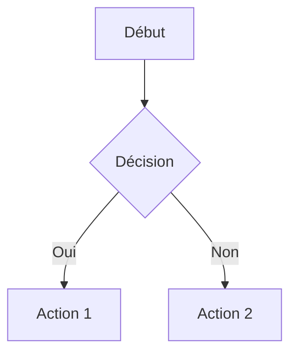

# 📋 Guide de Référence Rapide Markdown

Ce document est une référence rapide pour les syntaxes Markdown les plus courantes utilisées sur GitHub.

## 🎯 Syntaxes de Base

### Formatage de Texte

```markdown
**gras** ou __gras__
*italique* ou _italique_
***gras et italique***
~~barré~~
<sub>indice</sub> et <sup>exposant</sup>
```

### Titres

```markdown
# H1
## H2
### H3
#### H4
##### H5
###### H6
```

### Listes

```markdown
- Liste non ordonnée
  - Sous-élément
  
1. Liste ordonnée
2. Deuxième élément

- [ ] Tâche à faire
- [x] Tâche complétée
```

### Liens

```markdown
[Texte du lien](https://url.com)
[Lien avec titre](https://url.com "Titre")
[Lien vers section](#nom-section)
```

### Images

```markdown

[](https://lien.com)
```

### Code

````markdown
`code inline`

```javascript
// Bloc de code avec coloration
function hello() {
  console.log("Hello");
}
```
````

### Citations

```markdown
> Citation simple
>> Citation imbriquée
```

### Tables

```markdown
| Colonne 1 | Colonne 2 | Colonne 3 |
|-----------|:---------:|----------:|
| Gauche    | Centre    | Droite    |
```

## 🚀 Fonctionnalités GitHub

### Emojis

```markdown
:smile: :rocket: :heart: :+1:
```

### Mentions

```markdown
@username
#123 (issue/PR)
user/repo#123
```

### Alertes

```markdown
> [!NOTE]
> Information utile

> [!WARNING]
> Attention requise

> [!IMPORTANT]
> Information cruciale
```

### Accordéon

```markdown
<details>
<summary>Titre cliquable</summary>

Contenu caché

</details>
```

### Touches de Clavier

```markdown
<kbd>Ctrl</kbd> + <kbd>C</kbd>
```

### Expressions Mathématiques

```markdown
$E = mc^2$ (inline)

$$
\sum_{i=1}^{n} i = \frac{n(n+1)}{2}
$$
```

### Diagramme Mermaid

````markdown

```mermaid
graph TD
    A[Début] --> B{Décision}
    B -->|Oui| C[Action 1]
    B -->|Non| D[Action 2]
```
````

### Carte GeoJSON

````markdown
```geojson
{
  "type": "FeatureCollection",
  "features": [
    {
      "type": "Feature",
      "properties": {"name": "Paris"},
      "geometry": {
        "type": "Point",
        "coordinates": [2.3522, 48.8566]
      }
    }
  ]
}
```
````

### Code Diff

````markdown
```diff
- Code supprimé
+ Code ajouté
```
````

## 💡 Astuces

### Centrer du Texte

```markdown
<p align="center">
  Texte centré
</p>
```

### Image avec Taille

```markdown

```

### Ligne Horizontale

```markdown
---
***
___
```

### Notes de Bas de Page

```markdown
Texte avec note[^1]

[^1]: Contenu de la note
```

### Échapper des Caractères

```markdown
\* \_ \` \# \[ \]
```

## 📚 Ressources

- [Guide Markdown GitHub](https://docs.github.com/en/get-started/writing-on-github)
- [GitHub Flavored Markdown](https://github.github.com/gfm/)
- [Mermaid Docs](https://mermaid.js.org/)
- [Emoji Cheat Sheet](https://github.com/ikatyang/emoji-cheat-sheet)

---

**Consultez [README.md](./README.md) pour des exemples détaillés de chaque fonctionnalité !**
