# 🚀 Guide Complet des Fonctionnalités Markdown GitHub

> Ce repository est un bac à sable pour explorer toutes les possibilités d'affichage dans un README GitHub.

[](https://github.com/Martin-Boucault-35/testmd)
[](https://docs.github.com/en/get-started/writing-on-github)

---

## 📑 Table des Matières

- [Formatage de Texte](#-formatage-de-texte)
- [Listes](#-listes)
- [Liens et Ancres](#-liens-et-ancres)
- [Images](#-images)
- [Code](#-code)
- [Tables](#-tables)
- [Citations](#-citations)
- [Lignes Horizontales](#-lignes-horizontales)
- [Emojis](#-emojis)
- [Badges](#-badges)
- [Éléments HTML](#-éléments-html)
- [Expressions Mathématiques](#-expressions-mathématiques)
- [Diagrammes Mermaid](#-diagrammes-mermaid)
- [Diagrammes SVG et DrawIO](#-diagrammes-svg-et-drawio)
- [Cartes GeoJSON](#-cartes-geojson)
- [Blocs de Code Diff](#-blocs-de-code-diff)
- [Notes de Bas de Page](#-notes-de-bas-de-page)
- [Alertes et Callouts](#-alertes-et-callouts)
- [Listes de Tâches](#-listes-de-tâches)
- [Mentions et Références](#-mentions-et-références)
- [Touches de Clavier et Raccourcis](#-touches-de-clavier-et-raccourcis)
- [TopojSON et Autres Formats](#-topojson-et-autres-formats)

---

## 📝 Formatage de Texte

### Titres

# Titre H1
## Titre H2
### Titre H3
#### Titre H4
##### Titre H5
###### Titre H6

### Emphase et Style

Texte **gras** ou __gras__

Texte *italique* ou _italique_

Texte ***gras et italique*** ou ___gras et italique___

~~Texte barré~~

Texte <sub>indice</sub> et texte <sup>exposant</sup>

### Couleurs (avec HTML)

<span style="color:red">Texte rouge</span>
<span style="color:blue">Texte bleu</span>
<span style="color:green">Texte vert</span>

---

## 📋 Listes

### Liste Non Ordonnée

- Premier élément
- Deuxième élément
  - Sous-élément 2.1
  - Sous-élément 2.2
    - Sous-sous-élément 2.2.1
- Troisième élément

* Alternative avec astérisque
+ Alternative avec plus

### Liste Ordonnée

1. Premier élément
2. Deuxième élément
   1. Sous-élément 2.1
   2. Sous-élément 2.2
3. Troisième élément

### Liste de Définition (avec HTML)

<dl>
  <dt>Markdown</dt>
  <dd>Langage de balisage léger</dd>
  
  <dt>GitHub</dt>
  <dd>Plateforme de développement collaboratif</dd>
</dl>

---

## 🔗 Liens et Ancres

[Lien simple vers GitHub](https://github.com)

[Lien avec titre](https://github.com "Visitez GitHub")

<https://github.com> - URL automatique

[Lien vers une section](#-formatage-de-texte)

[Référence de lien][1]

[1]: https://github.com "Lien de référence"

---

## 🖼️ Images

### Image Inline


### Image avec Lien

[](https://github.com)

### Image Centrée (avec HTML)

<p align="center">
  
</p>

### Image avec Dimensions


### GIFs Animés

Les GIFs animés fonctionnent comme les images normales :


### Vidéos

GitHub supporte l'affichage de vidéos directement dans les README. Il suffit de glisser-déposer un fichier vidéo (MP4, MOV, etc.) dans l'éditeur GitHub ou de le référencer depuis les assets du repo.

**Formats supportés:** `.mp4`, `.mov`, `.webm`, `.ogv`, `.m4v`

> **Note:** Pour ajouter une vidéo, téléchargez-la dans les assets du repo ou utilisez GitHub Releases pour l'héberger.

Exemple avec une vidéo hébergée sur GitHub :
```markdown

```

---

## 💻 Code

### Code Inline

Utilisez `console.log()` pour afficher dans la console.

La commande `git status` affiche l'état du repository.

### Bloc de Code avec Coloration Syntaxique

#### JavaScript

```javascript
function helloWorld() {
  console.log("Hello, World!");
  return true;
}

const result = helloWorld();
```

#### Python

```python
def hello_world():
    """Affiche Hello World"""
    print("Hello, World!")
    return True

if __name__ == "__main__":
    hello_world()
```

#### Java

```java
public class HelloWorld {
    public static void main(String[] args) {
        System.out.println("Hello, World!");
    }
}
```

#### HTML

```html
<!DOCTYPE html>
<html lang="fr">
<head>
    <meta charset="UTF-8">
    <title>Hello World</title>
</head>
<body>
    <h1>Hello, World!</h1>
</body>
</html>
```

#### CSS

```css
.container {
    display: flex;
    justify-content: center;
    align-items: center;
    background-color: #f0f0f0;
    padding: 20px;
}

h1 {
    color: #333;
    font-size: 2rem;
}
```

#### SQL

Exemple de requête avec jointure :

```sql
SELECT users.name, orders.total
FROM users
INNER JOIN orders ON users.id = orders.user_id
WHERE orders.total > 100
ORDER BY orders.total DESC;
```

Exemple de création de table et insertion :

```sql
-- Création d'une table
CREATE TABLE products (
    id INT PRIMARY KEY AUTO_INCREMENT,
    name VARCHAR(100) NOT NULL,
    category VARCHAR(50),
    price DECIMAL(10, 2),
    stock INT DEFAULT 0,
    created_at TIMESTAMP DEFAULT CURRENT_TIMESTAMP
);

-- Insertion de données
INSERT INTO products (name, category, price, stock) 
VALUES 
    ('Laptop', 'Electronics', 999.99, 10),
    ('Mouse', 'Electronics', 29.99, 50),
    ('Keyboard', 'Electronics', 79.99, 30);

-- Requête avec agrégation
SELECT 
    category,
    COUNT(*) as total_products,
    AVG(price) as avg_price,
    SUM(stock) as total_stock
FROM products
GROUP BY category
HAVING AVG(price) > 50
ORDER BY total_products DESC;
```

#### Bash/Shell

```bash
#!/bin/bash

echo "Hello, World!"
for i in {1..5}; do
    echo "Iteration $i"
done
```

#### JSON

```json
{
  "name": "testmd",
  "version": "1.0.0",
  "description": "Guide complet Markdown",
  "author": "Martin-Boucault-35",
  "keywords": ["markdown", "github", "readme"]
}
```

#### YAML

```yaml
name: testmd
version: 1.0.0
description: Guide complet Markdown
dependencies:
  - markdown-parser
  - syntax-highlighter
```

---

## 📊 Tables

### Table Simple

| Colonne 1 | Colonne 2 | Colonne 3 |
|-----------|-----------|-----------|
| Ligne 1   | Donnée A  | Donnée B  |
| Ligne 2   | Donnée C  | Donnée D  |
| Ligne 3   | Donnée E  | Donnée F  |

### Table avec Alignement

| Gauche | Centre | Droite |
|:-------|:------:|-------:|
| A1     | B1     | C1     |
| A2     | B2     | C2     |
| A3     | B3     | C3     |

### Table Complexe

| Fonctionnalité | Support | Notes |
|----------------|:-------:|-------|
| **Texte formaté** | ✅ | Gras, italique, etc. |
| **Images** | ✅ | PNG, JPG, GIF, SVG |
| **Diagrammes** | ✅ | Mermaid intégré |
| **LaTeX** | ✅ | Formules mathématiques |
| **GeoJSON** | ✅ | Cartes interactives |

---

## 💬 Citations

> Ceci est une citation simple.

> Ceci est une citation
> sur plusieurs lignes.

> ### Citation avec titre
> 
> Ceci est une citation avec un titre et du **texte formaté**.
>
> - Liste dans une citation
> - Deuxième élément

> Citation niveau 1
>> Citation imbriquée niveau 2
>>> Citation imbriquée niveau 3

---

## ➖ Lignes Horizontales

Trois façons de créer des lignes horizontales :

---

***

___

---

## 😀 Emojis

### Emojis avec Codes

:smile: :heart: :rocket: :fire: :star: :+1: :tada: :sparkles: :100:

:computer: :books: :bulb: :mag: :pencil2: :clipboard: :chart_with_upwards_trend:

:fr: :uk: :us: :de: :es: :it: :jp: :cn:

### Emojis Unicode Directs

✨ 🚀 💻 📚 🔥 ⭐ 👍 🎉 💯 ❤️ 🎯 📊 🌟

---

## 🏆 Badges

### Badges de Build et Status


### Badges Technologiques


### Badges Sociaux


---

## 🔧 Éléments HTML

### Détails/Accordéon

<details>
<summary>Cliquez pour développer</summary>

Contenu caché qui apparaît quand on clique sur le résumé.

- Vous pouvez mettre n'importe quel markdown ici
- **Texte formaté**
- `Code`

```javascript
console.log("Code dans un accordéon");
```

</details>

<details>
<summary><b>Section avec code</b></summary>

```python
def fonction_cachée():
    print("Cette fonction est dans un accordéon")
```

</details>

### Commentaires HTML

<!-- Ceci est un commentaire invisible dans le rendu -->

### Éléments de Mise en Forme

<kbd>Ctrl</kbd> + <kbd>C</kbd> pour copier

<mark>Texte surligné</mark>

---

## 🔢 Expressions Mathématiques

### Inline

Équation inline : $E = mc^2$

Autre exemple : $x = \frac{-b \pm \sqrt{b^2-4ac}}{2a}$

### Bloc

```math
\begin{equation}
\int_{-\infty}^{\infty} e^{-x^2} dx = \sqrt{\pi}
\end{equation}
```

```math
\sum_{i=1}^{n} i = \frac{n(n+1)}{2}
```

### Formules Complexes

$$
\begin{bmatrix}
a & b \\
c & d
\end{bmatrix}
\times
\begin{bmatrix}
e & f \\
g & h
\end{bmatrix}
=
\begin{bmatrix}
ae + bg & af + bh \\
ce + dg & cf + dh
\end{bmatrix}
$$

---

## 📐 Diagrammes Mermaid

### Flowchart (Organigramme)

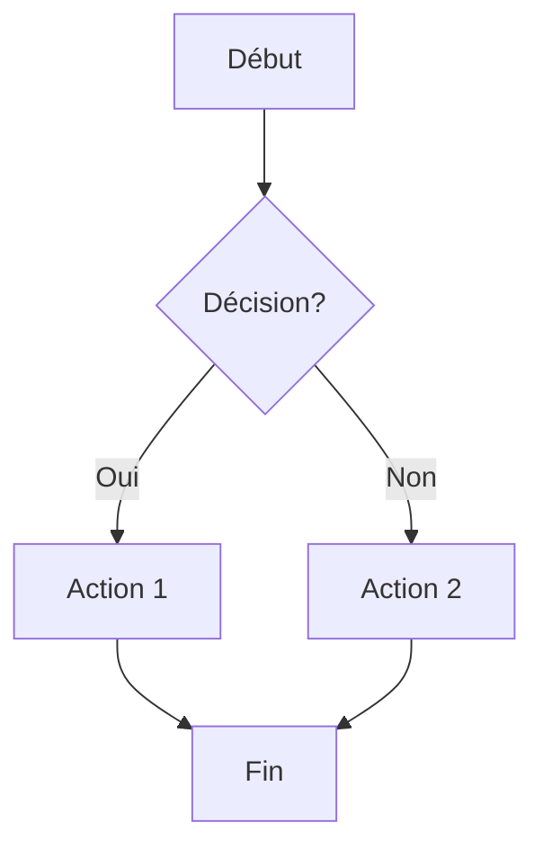

### Diagramme de Séquence

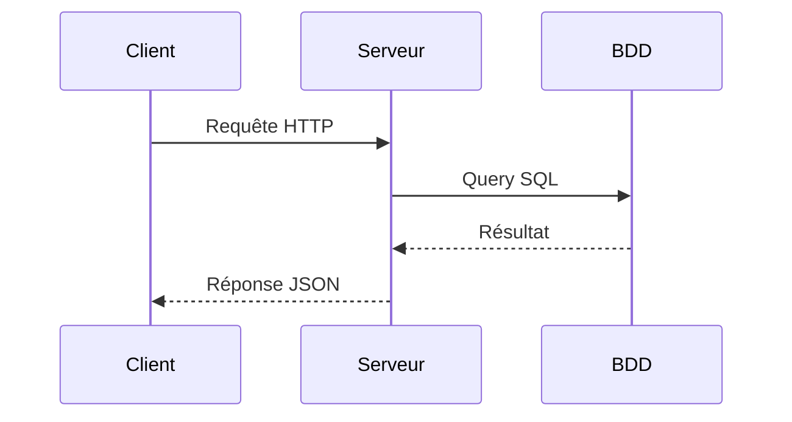

### Diagramme de Gantt

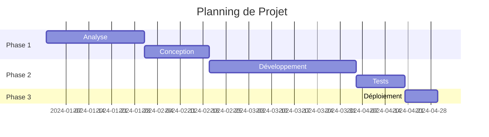

### Diagramme de Classes

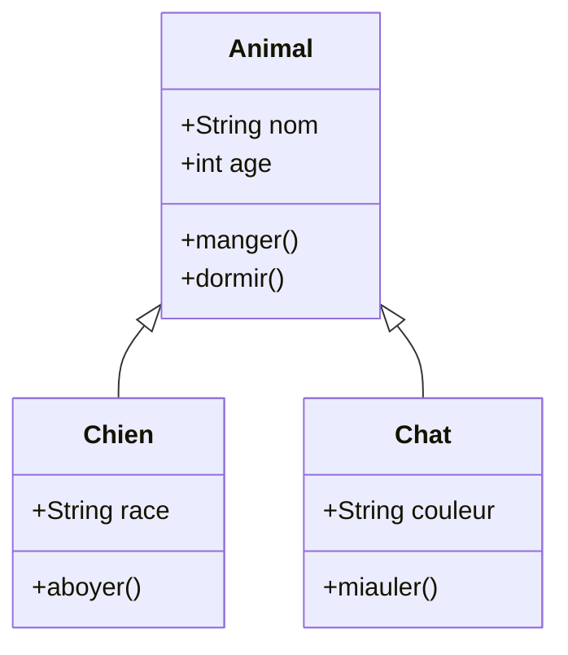

### Diagramme d'États

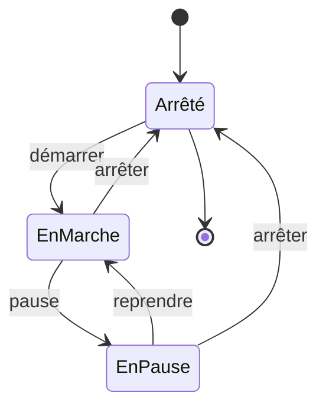

### Diagramme Entity-Relationship

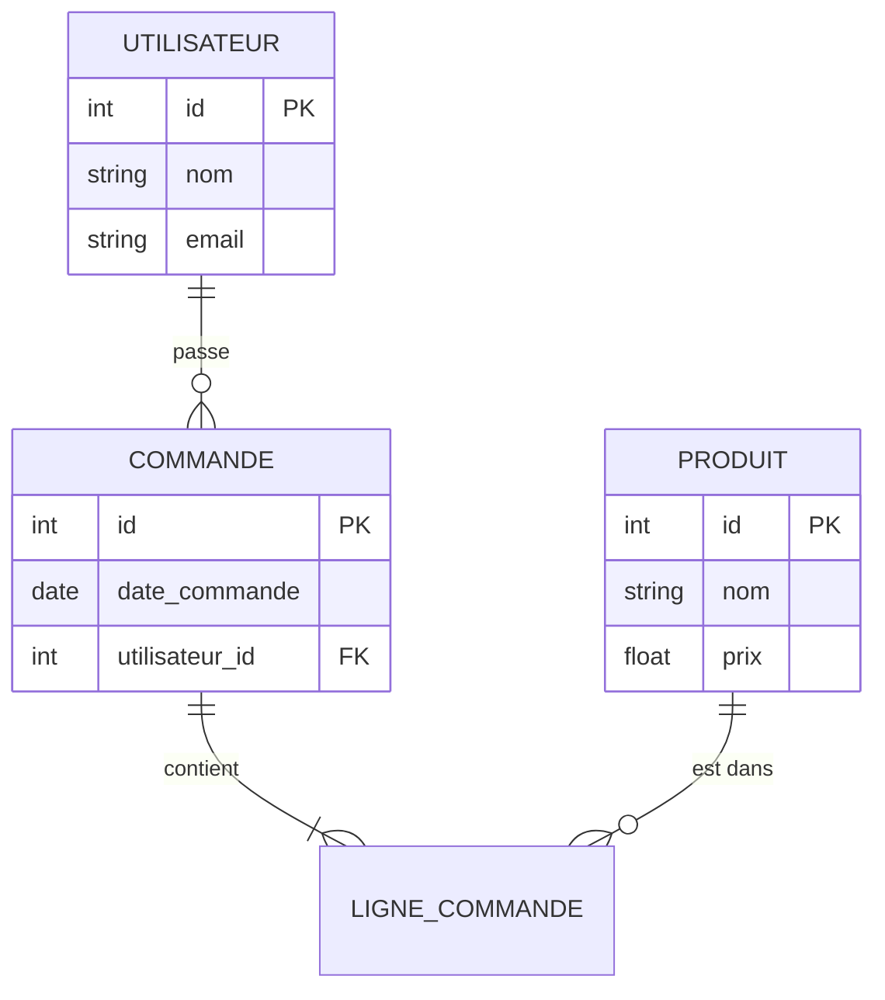

### Diagramme en Camembert (Pie Chart)

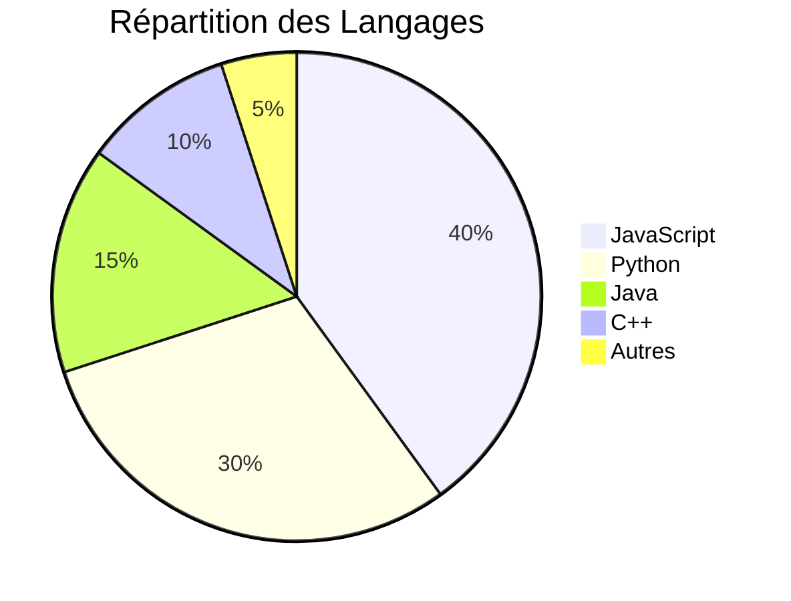

### Diagramme de Git

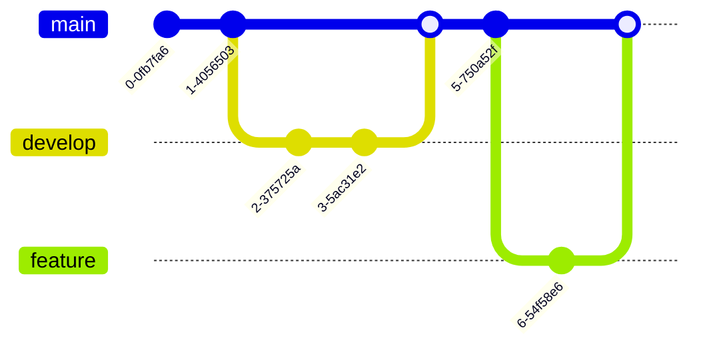

### Diagramme de Journey (Parcours Utilisateur)

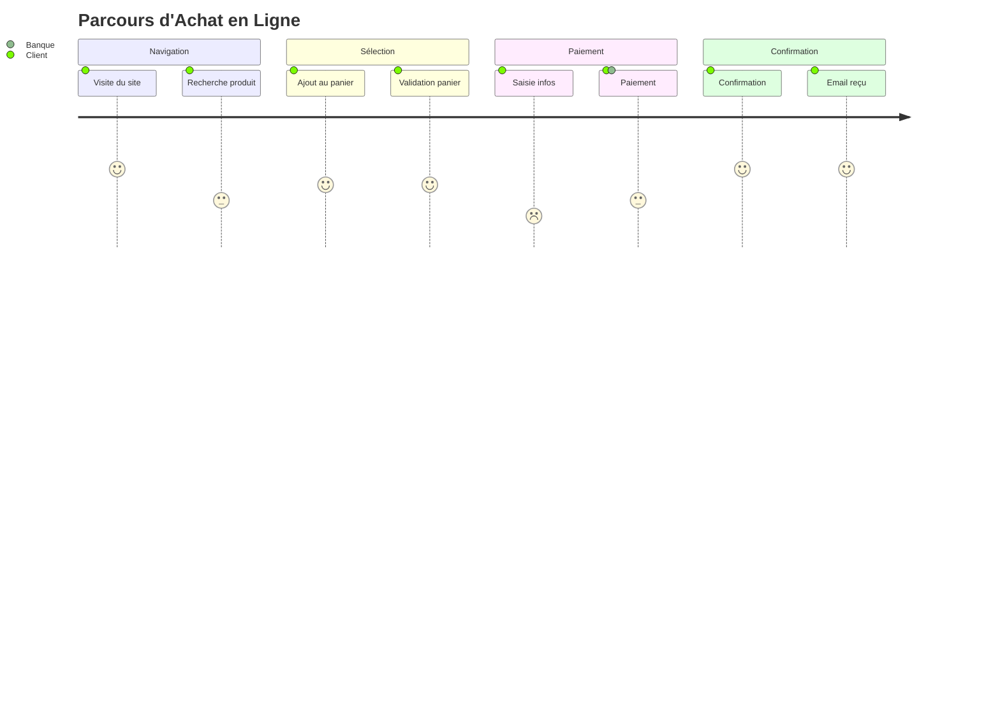

### Diagramme de Mindmap

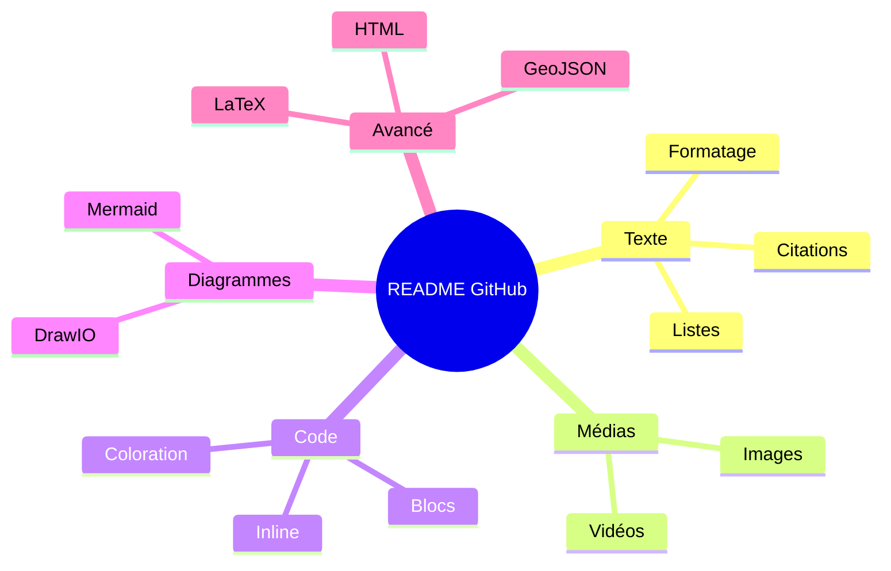

---

## 🎨 Diagrammes SVG et DrawIO

### Image SVG Intégrée

GitHub supporte les fichiers SVG directement dans les README :

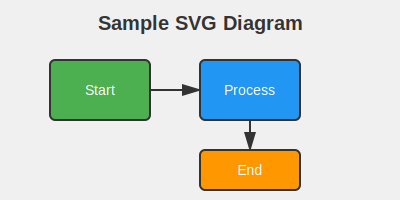

### Diagramme DrawIO

Les fichiers DrawIO (`.drawio` ou `.drawio.svg`) peuvent être créés avec [diagrams.net](https://app.diagrams.net/) et intégrés dans GitHub. Pour afficher un diagramme DrawIO dans un README, il faut l'exporter en PNG ou SVG :

> **Note:** Les fichiers `.drawio` ne s'affichent pas directement dans les README, mais GitHub a une intégration DrawIO permettant de les éditer directement dans l'interface.

**Fichier disponible:** [example.drawio](./assets/example.drawio)

### SVG Inline (avec code HTML)

Vous pouvez aussi intégrer du SVG directement dans le markdown :

```html
<svg width="200" height="100" xmlns="http://www.w3.org/2000/svg">
  <rect width="200" height="100" fill="#4CAF50"/>
  <text x="100" y="55" font-family="Arial" font-size="20" text-anchor="middle" fill="white">
    SVG Inline
  </text>
</svg>
```

<svg width="200" height="100" xmlns="http://www.w3.org/2000/svg">
  <rect width="200" height="100" fill="#4CAF50"/>
  <text x="100" y="55" font-family="Arial" font-size="20" text-anchor="middle" fill="white">
    SVG Inline
  </text>
</svg>

### Diagramme PlantUML via URL

Vous pouvez aussi utiliser PlantUML via des services en ligne :

```

```

---

## 🗺️ Cartes GeoJSON

### Carte Simple avec un Point

```geojson
{
  "type": "FeatureCollection",
  "features": [
    {
      "type": "Feature",
      "properties": {
        "name": "Paris",
        "description": "Capitale de la France"
      },
      "geometry": {
        "type": "Point",
        "coordinates": [2.3522, 48.8566]
      }
    }
  ]
}
```

### Carte avec Plusieurs Points

```geojson
{
  "type": "FeatureCollection",
  "features": [
    {
      "type": "Feature",
      "properties": {
        "name": "Londres"
      },
      "geometry": {
        "type": "Point",
        "coordinates": [-0.1276, 51.5074]
      }
    },
    {
      "type": "Feature",
      "properties": {
        "name": "Berlin"
      },
      "geometry": {
        "type": "Point",
        "coordinates": [13.4050, 52.5200]
      }
    },
    {
      "type": "Feature",
      "properties": {
        "name": "Madrid"
      },
      "geometry": {
        "type": "Point",
        "coordinates": [-3.7038, 40.4168]
      }
    }
  ]
}
```

### Ligne (Trajet)

```geojson
{
  "type": "FeatureCollection",
  "features": [
    {
      "type": "Feature",
      "properties": {
        "name": "Route"
      },
      "geometry": {
        "type": "LineString",
        "coordinates": [
          [2.3522, 48.8566],
          [-0.1276, 51.5074],
          [13.4050, 52.5200]
        ]
      }
    }
  ]
}
```

---

## 🔄 Blocs de Code Diff

### Modification de Code

```diff
function helloWorld() {
-  console.log("Hello, World!");
+  console.log("Bonjour, le Monde!");
+  return true;
}
```

### Fichier de Configuration

```diff
{
  "name": "mon-projet",
- "version": "1.0.0",
+ "version": "2.0.0",
  "dependencies": {
-   "express": "^4.17.1"
+   "express": "^4.18.2"
  }
}
```

---

## 📝 Notes de Bas de Page

Voici un texte avec une note de bas de page[^1].

On peut aussi avoir plusieurs notes[^2] dans le même document.

Les notes peuvent contenir plusieurs paragraphes[^note-longue].

[^1]: Ceci est la première note de bas de page.

[^2]: Ceci est la deuxième note de bas de page.

[^note-longue]: Ceci est une note plus longue.
    
    Elle peut contenir plusieurs paragraphes.
    
    Et même du **texte formaté** !

---

## ⚠️ Alertes et Callouts

> [!NOTE]
> Informations utiles que les utilisateurs devraient connaître, même en parcourant rapidement le contenu.

> [!TIP]
> Conseils utiles pour aider les utilisateurs à mieux réussir.

> [!IMPORTANT]
> Informations cruciales nécessaires pour que les utilisateurs réussissent.

> [!WARNING]
> Contenu urgent nécessitant l'attention immédiate de l'utilisateur en raison de risques potentiels.

> [!CAUTION]
> Conséquences négatives potentielles d'une action.

---

## ✅ Listes de Tâches

### Tâches Simples

- [x] Tâche complétée
- [x] Autre tâche terminée
- [ ] Tâche en cours
- [ ] Tâche à faire

### Tâches Imbriquées

- [x] Phase 1 : Planification
  - [x] Définir les objectifs
  - [x] Créer le planning
- [ ] Phase 2 : Développement
  - [x] Configuration de l'environnement
  - [ ] Développement des fonctionnalités
  - [ ] Tests unitaires
- [ ] Phase 3 : Déploiement
  - [ ] Tests d'intégration
  - [ ] Mise en production

---

## 🔗 Mentions et Références

### Mentions d'Utilisateurs

Vous pouvez mentionner des utilisateurs avec @username (sera cliquable sur GitHub).

**Exemple:** Merci à @Martin-Boucault-35 pour ce guide complet !

### Références d'Issues et PR

Références : #1, #2, #123 (si les issues existent dans le repo)

**Exemple:** Cette fonctionnalité a été ajoutée suite à #2

Références externes : Martin-Boucault-35/autre-repo#123

### Commits

Référence à un commit : `a1b2c3d` (le SHA sera automatiquement lié)

**Exemple:** La vidéo d'exemple a été ajoutée dans le commit 927cb4b0dfb53205a3907cb48244408f00da5513

---

## ⌨️ Touches de Clavier et Raccourcis

Vous pouvez afficher des touches de clavier avec la balise `<kbd>` :

<kbd>Ctrl</kbd> + <kbd>C</kbd> - Copier

<kbd>Ctrl</kbd> + <kbd>V</kbd> - Coller

<kbd>Ctrl</kbd> + <kbd>Z</kbd> - Annuler

<kbd>Ctrl</kbd> + <kbd>Shift</kbd> + <kbd>P</kbd> - Command Palette

<kbd>⌘</kbd> + <kbd>S</kbd> - Sauvegarder (Mac)

<kbd>Alt</kbd> + <kbd>Tab</kbd> - Changer d'application

<kbd>F5</kbd> - Actualiser

<kbd>Esc</kbd> - Échapper

### Combinaisons Complexes

<kbd><kbd>Ctrl</kbd> + <kbd>Alt</kbd> + <kbd>Del</kbd></kbd>

---

## 🌍 TopoJSON et Autres Formats

### TopoJSON

GitHub supporte aussi les fichiers TopoJSON pour des cartes plus efficaces :

```topojson
{
  "type": "Topology",
  "objects": {
    "example": {
      "type": "GeometryCollection",
      "geometries": [
        {
          "type": "Point",
          "properties": {"name": "Paris"},
          "coordinates": [2.3522, 48.8566]
        }
      ]
    }
  },
  "arcs": [],
  "bbox": [-180, -90, 180, 90]
}
```

### Modèles 3D STL

GitHub peut afficher des modèles 3D au format STL directement dans le navigateur :

> **Note:** Pour afficher un modèle 3D, ajoutez un fichier `.stl` dans votre repository. GitHub le rendra automatiquement avec un visualiseur 3D interactif.

**Exemple de modèle 3D intégré dans ce repository :**


Vous pouvez aussi référencer des modèles dans le dossier assets :
```markdown

```

### CSV et Fichiers Tabulaires

GitHub peut aussi afficher des fichiers CSV dans une table formatée :

**Fichier CSV :**
```csv
Nom,Prénom,Âge,Ville
Dupont,Jean,30,Paris
Martin,Marie,25,Lyon
Bernard,Pierre,35,Marseille
```

> Les fichiers `.csv` sont automatiquement rendus sous forme de tableau sur GitHub.

**Exemple de fichier CSV dans ce repo :** [sample-data.csv](./assets/sample-data.csv)

---

## 📚 Ressources Supplémentaires

### Documentation Officielle

- [GitHub Flavored Markdown Spec](https://github.github.com/gfm/)
- [Guide Markdown GitHub](https://docs.github.com/en/get-started/writing-on-github)
- [Mermaid Documentation](https://mermaid.js.org/)
- [Shields.io - Badges](https://shields.io/)

### Outils Utiles

- [Markdown Tables Generator](https://www.tablesgenerator.com/markdown_tables)
- [Mermaid Live Editor](https://mermaid.live/)
- [Emoji Cheat Sheet](https://github.com/ikatyang/emoji-cheat-sheet)
- [GeoJSON.io](https://geojson.io/)

---

## 🎨 Astuces Avancées

### Centrer du Texte

<p align="center">
  <b>Texte centré en gras</b>
</p>

### Image avec Légende

<figure>
  
  <figcaption>Figure 1: Logo GitHub</figcaption>
</figure>

### Table sans Bordures (avec HTML)

<table>
<tr>
<td width="50%">

### Colonne 1
- Point 1
- Point 2
- Point 3

</td>
<td width="50%">

### Colonne 2
- Point A
- Point B
- Point C

</td>
</tr>
</table>

### Jupyter Notebooks

GitHub affiche automatiquement les fichiers `.ipynb` (Jupyter Notebooks) avec une mise en forme complète incluant le code, les sorties et les visualisations.

**Exemple :** Créez un fichier `analysis.ipynb` et GitHub le rendra automatiquement !

### Collapse Sections (Sections Réductibles)

Combinez plusieurs éléments `<details>` pour créer une FAQ ou documentation structurée :

<details>
<summary>❓ Comment installer ce projet ?</summary>
<br>

1. Clonez le repository
   ```bash
   git clone https://github.com/username/repo.git
   ```
2. Installez les dépendances
   ```bash
   npm install
   ```
3. Lancez le projet
   ```bash
   npm start
   ```
</details>

<details>
<summary>❓ Quelles sont les technologies utilisées ?</summary>
<br>

- **Frontend:** React, TypeScript
- **Backend:** Node.js, Express
- **Base de données:** PostgreSQL
- **DevOps:** Docker, GitHub Actions
</details>

### Liens avec Ancres Personnalisées

Vous pouvez créer des ancres personnalisées avec HTML :

<a id="ancre-personnalisee"></a>

Puis y faire référence : [Aller à l'ancre personnalisée](#ancre-personnalisee)


---

## 🎯 Conclusion

Ce README démontre l'ensemble des fonctionnalités disponibles pour créer des documents riches et interactifs sur GitHub. Markdown, combiné avec les extensions GitHub, permet de créer une documentation professionnelle et engageante.

### Récapitulatif

✨ **Fonctionnalités Couvertes:**
- ✅ **Formatage de texte** : Titres, gras, italique, barré, indice, exposant
- ✅ **Listes** : Ordonnées, non ordonnées, imbriquées, de définition
- ✅ **Images et médias** : PNG, JPG, GIF, SVG, vidéos
- ✅ **Liens** : Simples, avec ancres, références
- ✅ **Code** : Inline et blocs avec coloration syntaxique (JavaScript, Python, Java, HTML, CSS, SQL, Bash, JSON, YAML)
- ✅ **Tables** : Simples et complexes avec alignement
- ✅ **Citations** : Simples et imbriquées
- ✅ **Emojis** : Codes et Unicode directs
- ✅ **Badges** : Build status, technologies, sociaux
- ✅ **Éléments HTML** : Détails/Accordéon, kbd, mark
- ✅ **Expressions mathématiques** : LaTeX inline et blocs
- ✅ **Diagrammes Mermaid** : Flowchart, séquence, Gantt, classes, états, ER, pie, git, journey, mindmap
- ✅ **Diagrammes SVG et DrawIO** : Intégrés et inline
- ✅ **Cartes** : GeoJSON et TopoJSON
- ✅ **Code Diff** : Modifications de code
- ✅ **Notes de bas de page** : Références et annotations
- ✅ **Alertes GitHub** : Note, Tip, Important, Warning, Caution
- ✅ **Listes de tâches** : Simples et imbriquées
- ✅ **Mentions et références** : Users, issues, PR, commits
- ✅ **Touches de clavier** : Raccourcis avec kbd
- ✅ **Formats avancés** : CSV, STL 3D, Jupyter Notebooks
- ✅ **Astuces** : Centrage, sections réductibles, ancres personnalisées

---

<p align="center">
  <b>⭐ Si ce guide vous a été utile, n'hésitez pas à lui donner une étoile ! ⭐</b>
</p>

<p align="center">
  Made with ❤️ for the GitHub Community
</p>

---

**Dernière mise à jour:** Décembre 2024
